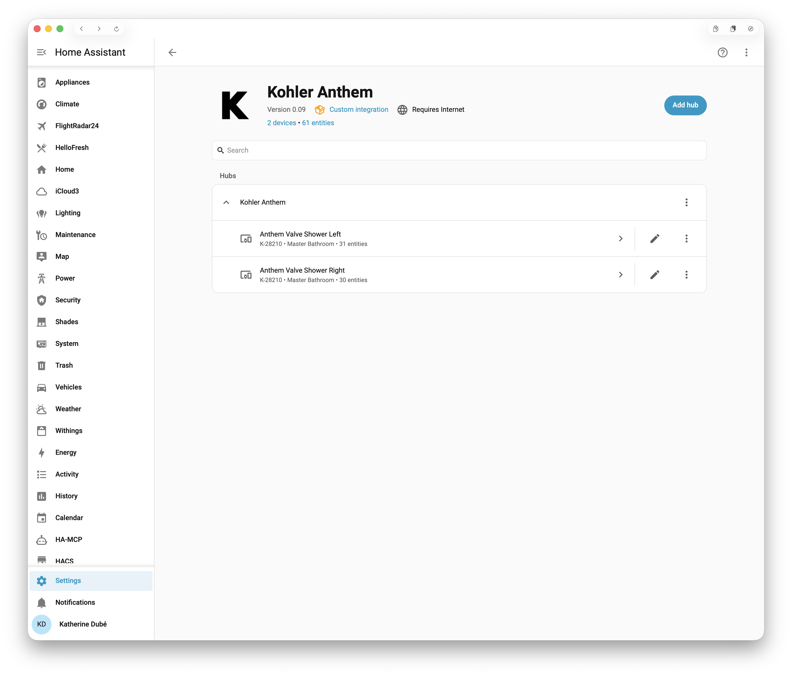
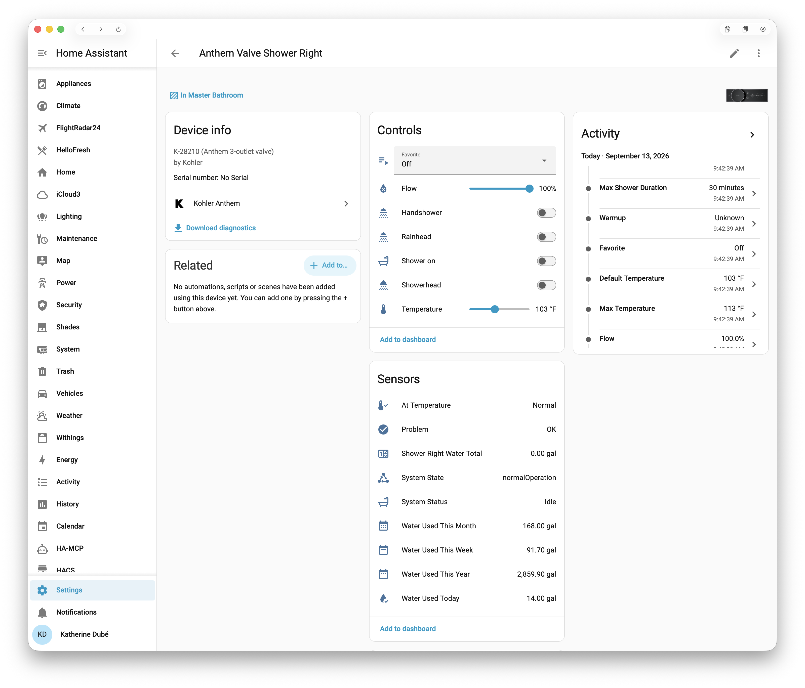

<h1 align="center">(Unofficial) Home Assistant Integration for Kohler Konnect</h1>

  A custom Home Assistant integration for Kohler's connected kitchen and bath: <b>Anthem</b> and <b>Anthem+</b> digital showers, and <b>Sensate</b> kitchen faucets.

  
  
  
  
  

> ⚠️ This is an **unofficial** integration. It is not affiliated with or endorsed by Kohler, and the underlying API may change at any time.

  

## One account, every device

The Konnect app is one experience for everything Kohler connects, and so is this
integration: sign in once and every supported device on the account appears, each as its own
device with its own entities.

**Anthem** — the digital shower valve, Wi-Fi built in. Controlled with a raw command word:
any outlet, any temperature, any time.

**Anthem Plus** — a Linux system controller that sits in front of the valve, adding music
(with Kohler's K-30319 amplifier), lighting, steam, and support for a second valve body.
Controlled by activating named favorites — whole scenes, not individual outlets.

**Sensate** — the touchless kitchen faucet. Water on and off, measured dispenses ("pour a
litre"), the presets saved in the Konnect app, and leak alerts.

An account with several of any of them gets them all. See
[the full guide](docs/user_guide.md#using-both-together) for how a valve and a controller
interact when combined.

> **Coming from Kohler Anthem or Kohler Sensate?** This replaces both. See
> [Upgrading](#upgrading-from-kohler-anthem-or-kohler-sensate) — it is a new integration, so
> it is added afresh rather than updated in place.

  

### Highlights

**Showers**

* **Per-outlet control** — every outlet is its own switch, in both zones.
* **Live outlet and temperature** — move a setpoint or flip an outlet and the water follows
  immediately. No scene to apply, no confirm step.
* **One-command shower** — a `custom_shower` action sends outlets and temperature to the
  valve as a single command, the reliable way to drive it from an automation.
* **Raw escape hatch** — a `send_valve_hex` action for anything the normal controls can't do.

**Faucets**

* **Water on and off**, with a safety limit that turns off water Home Assistant turned on
  and nobody turned off.
* **Measured dispenses** — one-tap buttons, a free-choice amount, and a `dispense` action
  ("dispense 2 cups", "dispense 300 mL" or a preset by name) for automations and voice.
* **Konnect presets** — pick one and pour it; presets added or renamed in the app follow.
* **Leak alerts** — the moment Kohler reports one, with a button to acknowledge it.

**Both**

* **Water used** today, this week, this month and this year — Kohler's own figures, the ones
  the Konnect app charts, in the units your Konnect account uses.
* **Firmware status** — whether Kohler has an update for each device.

### Real-time state

Kohler's cloud announces changes over one MQTT connection per account, and every device on
the account shares it.

* **Showers are push-only.** Nothing polls the shower's state on an interval: open an outlet
  at the touchscreen, nudge the temperature in the Konnect app, or let the shower stop itself
  — Home Assistant knows as it happens.
* **Faucets poll as a safety net.** Each faucet is checked every 30 seconds until the
  connection has proven it reports that faucet's changes, then only every few minutes. If a
  change ever slips past it, polling takes charge again.
* **Easy on your network — and on Kohler's.** One connection stays open and waits, rather
  than signing in and asking over and over.

## Requirements

* Home Assistant **2026.3** or later
* A Kohler Konnect account, with your devices already set up in the Konnect app
* **Internet access.** Control is cloud-only for every product. If Kohler's cloud is
  unreachable, nothing here can turn water on or off.

The only Python dependency is `paho-mqtt`, installed automatically.

## Install

This integration is **not in HACS's default store.** Add it as a custom repository.

**Via HACS**

That button opens this repository in HACS on your own instance, adds it as a custom repository
and offers the download. It needs [My Home Assistant](https://my.home-assistant.io/) set up in
your browser. Otherwise, add it by hand:

1. In HACS, open the ⋮ menu and choose **Custom repositories**
2. Add `kedube/ha-kohler-konnect` (or the full GitHub URL), category **Integration**
3. Find **Kohler Konnect** in HACS and install it
4. Restart Home Assistant

HACS installs from **releases**, not from the latest commit.

**Manually**

Copy the `custom_components/kohler_konnect/` folder from this repository into the
`custom_components/` folder of your Home Assistant configuration directory, so that
`config/custom_components/kohler_konnect/manifest.json` exists, and restart.

## Setup

**Settings → Devices & Services → Add Integration → Kohler Konnect**

Sign in with your Konnect account and you are done. The integration reads the account, works
out which hardware you have — valve model, how the outlets split across zones, whether a
controller is in front of it, which faucets there are — and builds the matching devices
itself. Your password is exchanged for a token and never stored, and temperature and water
units follow whatever your Konnect account already uses.

**Configure** on the integration card has two settings, each shown only on an account where
it applies: how a two-zone valve's outlets and controls are grouped and named, and the
faucets' water safety limit. Everything else that can change after setup is an entity on the device page,
where automations and dashboards can reach it too.

## Upgrading from Kohler Anthem or Kohler Sensate

Kohler Konnect replaces both, under a new name (`kohler_konnect`) — so it is a new
integration, not an update, and nothing carries over by itself. Until the old entries are
removed, a card in **Settings → Repairs** says which are still there.

1. **Note what refers to the old entities** — automations, scripts, dashboards, the Energy
   dashboard.
2. **Delete the old entries** in **Settings → Devices & services**, then remove the old
   integrations in HACS and restart.
3. **Install Kohler Konnect and add your account** as above.

Deleting the old entries first matters: entity ids come from the device and entity names, so
on a cleared registry most come back exactly as they were — `switch.anthem_valve_shower_on`,
`switch.kitchen_water`. History follows the entity id. A few entities Kohler Anthem renamed
over the years come back under their current names; the
[full guide](docs/user_guide.md#upgrading-from-kohler-anthem-or-kohler-sensate) lists them.
What else changes:

* **Actions** are now `kohler_konnect.custom_shower`, `kohler_konnect.send_valve_hex` and
  `kohler_konnect.dispense`. `dispense` no longer takes `amount_ml` or `amount_l`; use
  `amount` with `unit`.
* **Faucet water usage** is now Today, This Week, This Month and This Year, as for the
  valves. The faucet's lifetime **Total water used** is gone: use **Water used today** in
  the Energy dashboard instead.
* **Faucet units** follow your Konnect account's unit setting; the separate metric/imperial
  option is gone.
* **Faucet firmware** is `update.<faucet>_firmware_status`, matching the showers'.

## What works, and what does not

**Supported**

* **Kohler Anthem Digital Valve** — `K-28209`, `K-28210`, `K-28211`, `K-28212`. One unit
  containing up to two zones, each with up to three outlets. An installation that doesn't
  match one of the four still works — an unrecognised outlet split produces a usable model
  rather than an error.
* **Anthem Interface** (`K-28214`) and **Anthem+ Interface** (`K-28214-ASC`), with the
  **Anthem+ System Controller** (`K-27756`).
* **Kohler Sensate** touchless kitchen faucet, and the second Konnect kitchen faucet the app
  handles identically (SKU `SET`, almost certainly the Setra — untested).

⚠️ **Not supported**

* **The older DTV systems.** A previous generation of Kohler digital showering, on a
  different protocol entirely. Nothing here applies to them.
* **Kohler Duo Control.** No Wi-Fi and no Konnect connection, so there is nothing for an
  integration to talk to.
* **The mechanical Anthem.** Kohler sells both under that name. Only the digital,
  network-connected one has an API.
* **Other Konnect products** (toilets, mirrors, H2Wise, bath fillers). They are ignored, not
  broken — but nothing here drives them.

## Contributing

Different hardware is the most useful thing anyone can contribute. Two things make a report
diagnosable:

* **Download diagnostics** — on the integration card and every device page. One JSON report
  of the whole installation, with credentials, account identity and serial numbers redacted.
  On anything other than the hardware listed under Known limitations, this is the single
  most useful file you can send.
* **Report Log** — a switch on the valve and controller device pages that captures every raw MQTT message
  on the account, faucets' included, one file per switch-on, continuing across a Home
  Assistant restart so "it breaks when I restart" stays one piece of evidence.

Check both before sharing — they carry device identifiers and show when water was used.
The reports folder lives inside the integration, so updating or reinstalling deletes it.

## Known limitations

* **Cloud-only.** No local control path exists for any of these products.
* **Flow may be overwritten on some hardware.** Each zone has a Flow number. A
  first-generation Anthem touchscreen has been captured rewriting both zones the moment its
  flow panel is opened, so on such an install a setpoint may not hold — disable the entity if
  yours behaves that way.
* **The API is undocumented** and Kohler can change it without notice.
* **Tested hardware** — a K-28212 (six outlets, three and three) with a controller on firmware
  2.88, two K-28210 valves, and a Sensate faucet on firmware 16.0. Other models are
  supported on what the protocol says, not on anyone having run them.
* **Faucet commands are signed differently now.** The old faucet integration signed in with
  Kohler's password policy; this one uses the same sign-in as the showers and the Konnect app.
  Kohler's app sends faucet commands that way, but this integration has not yet been run
  against a faucet with it.

This is an unofficial, community-built integration, reverse-engineered from Kohler's cloud
protocol. It is not a supported product, and it comes with no warranty of any kind. Anything
that can run water deserves that caution.

## Documentation

**[The full guide](docs/user_guide.md)** covers every entity, the actions, each feature in
detail, automation examples and troubleshooting.

**[docs/](docs/)** also has the valve command word reference
([`gcs/valve_hex.md`](docs/gcs/valve_hex.md)), how to capture diagnostics
([`mqtt/capture_runbook.md`](docs/mqtt/capture_runbook.md)), and — for developers — a
reference to Kohler Konnect's cloud protocol ([`protocol/`](docs/protocol/README.md)),
written so other Kohler integrations can reuse it.

## Prior art

This project builds on [frozenmartini/kohler-anthem-plus](https://github.com/frozenmartini/kohler-anthem-plus)
and [kenyonj/kohler-konnect-ha](https://github.com/kenyonj/kohler-konnect-ha). Credit to both
for the original work. The faucet support began as a separate integration,
[kedube/ha-kohler-sensate](https://github.com/kedube/ha-kohler-sensate), which this one now
replaces.

## Licence and trademarks

MIT — see [LICENSE](LICENSE).

Kohler, Anthem, Anthem+, Sensate and Konnect are trademarks of Kohler Co. This project is not
affiliated with, authorised by, or endorsed by Kohler Co., and is not a supported product.
